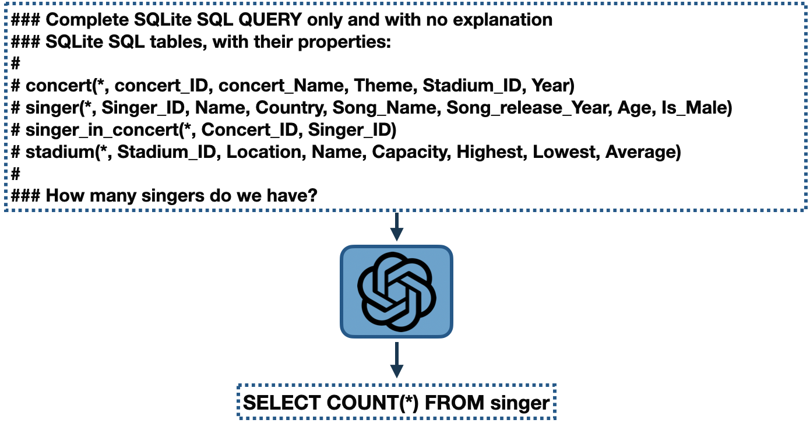
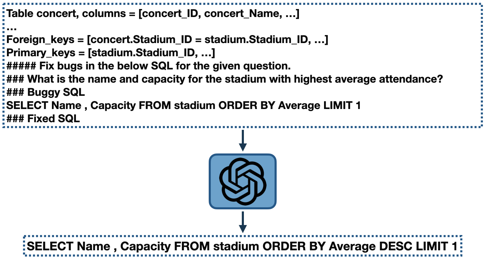
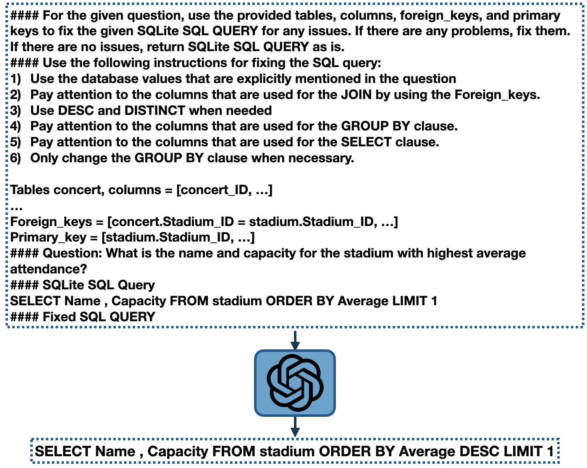

# Few-shot-NL2SQL-with-prompting
The prompts are availabe in prompt directory

## Table of contents
* [Dataset](#dataset)
* [Setup](#setup)
* [Zero-shot](#Zero-shot)
* [Self-correction][#self-correction]


## dataset
To reproduce the results reported in the paper, please download the Spider dataset from the link below and create a data directory containing the tables.json and dev.json files.

```
$ Spider dataset = "https://drive.google.com/uc?export=download&id=1TqleXec_OykOYFREKKtschzY29dUcVAQ"
```


## setup
To run this project, use the following commands:

```
$ pip3 install -r requirements.txt
$ echo "Start running DIN-SQL.py"
$ python3 DIN-SQL.py --dataset ./data/ --output predicted_sql.txt
$ echo "Finished running DIN-SQL.py"
```

## Zero-shot
The zero-shot prompt template used in the paper:



## Self-Correction
The Generic self-correction prompt was implemented in a zero-shot setting, where all queries were
assumed to be "Buggy SQL".



The Gentle self-correction prompt was implemented in a zero-shot setting. For this self-correction prompt
we don’t have the assumption of being Buggy and we included some instructions for fixing the SQL
queries. 


